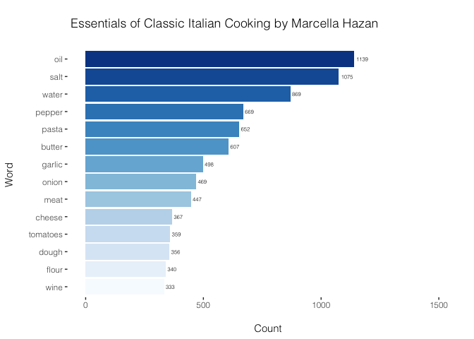
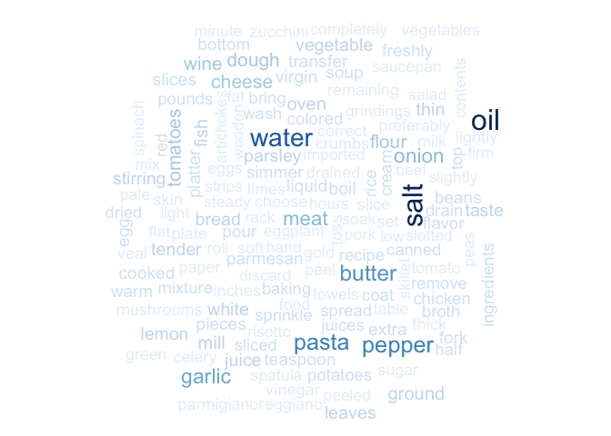
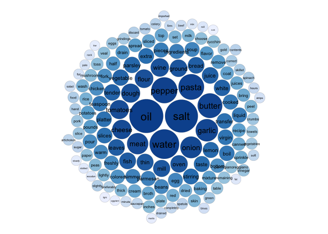
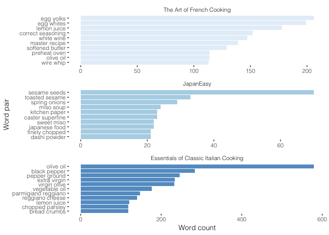
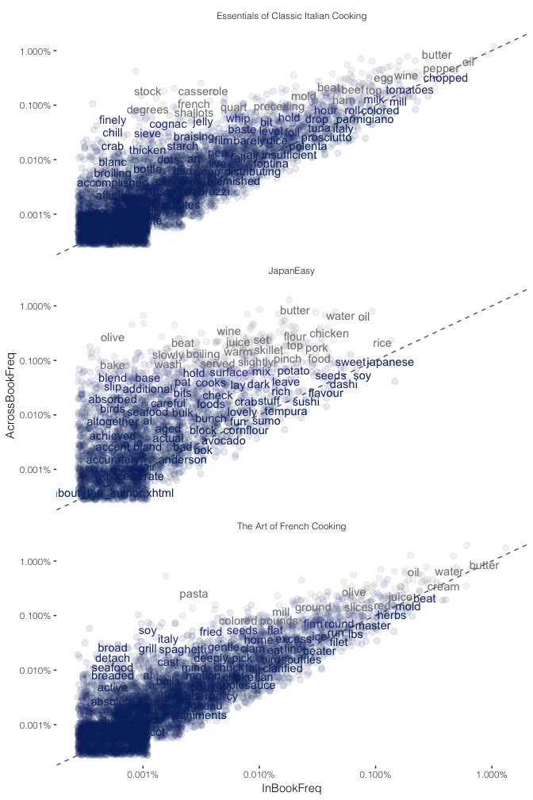
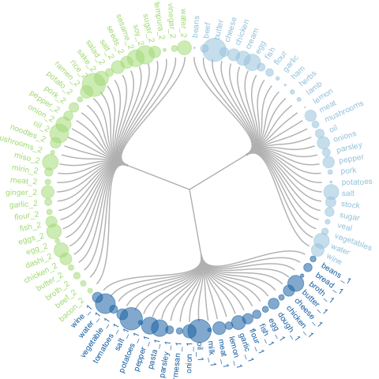
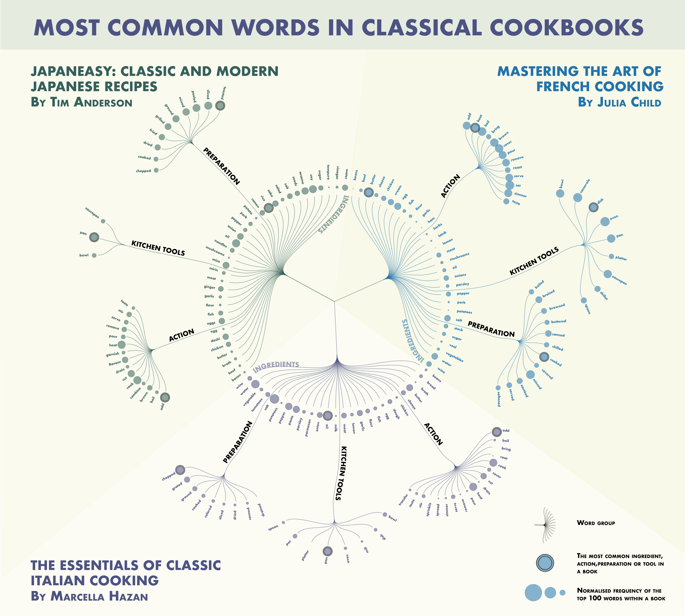

TextMiningForBooks
================
Bernadeta
2018-09-23

Firstly, I need to convert the books I'm interested in using into a plain text format. I'm not going to show how I do this as I simply adapted the code from <a href="https://rud.is/b/2018/04/12/convert-epub-to-text-for-processing-in-r/">rud.is blog</a>, the same code is now available as an R pubcrawl library, which you can find on <a href="https://github.com/hrbrmstr/pubcrawl">github</a>.

I'm using three books this time: Mastering the Art of French Cooking by Julia Child Essentials of Classic Italian Cooking by Marcella Hazan JapanEasy: Classic and Modern Japanese Recipes to Cook at Home Book by Tim Anderson

The JapanEasy is kind of an outlier here not only because it is quite a different culture (exactly why I picked it), but also because comparing it to iconic books such as Child's and Hazan's is not quite right (no offence Tim), but is was the one ebook that I could get hold of, so I rolled with it anyway.

``` r
library(dplyr)
library(stringr)
library(tidyr)
library(tidytext)
library(tm)
library(ggplot2)
library(ggthemes)
library(RColorBrewer)

# Read a book in and remove numbers and punctuation
MHBook <- readLines("Essentials_of_Classic_Italian_Cooking.txt")
MHBook <- removeNumbers(MHBook)
MHBook <- removePunctuation(MHBook)
MHBook_df <- data_frame(Text = MHBook) # make tibble 

# Each paragrapgh should be placed in a row, let's see 
head(MHBook_df)
```

    ## # A tibble: 6 x 1
    ##   Text                                                                     
    ##   <chr>                                                                    
    ## 1 path size date content                                                   
    ## 2 " OEBPSHazaepubcrhtm    FUNDAMENTALS"                                    
    ## 3 ""                                                                       
    ## 4 Where Flavor Starts                                                      
    ## 5 FLAVOR IN ITALIAN DISHES builds up from the bottom It is not a cover it …
    ## 6 BATTUTO

Now we can take our table and split every word in it into a separate cell in each row.

``` r
MHBookWords <- MHBook_df %>% 
  unnest_tokens(output = word, input = Text)
```

Doing this the 1st time I did not think about it, but obviously all texts are filled with words that don't carry much context but are a kind of a "binding medium" for a language; words like "a", "after", "you", "all","it", etc. So, these need to be removed. There's a conveniant stop\_words(en) table of the stopwords in english language that comes with the tidytext library, which I can use to do so.

``` r
stop_word_table <- bind_rows(stop_words,
                               data_frame(word = c(word = c(stopwords("en")), 
                                                   lexicon = "custom")))
```

I can also add a custom list of stopwords. In this case, as these are cookbooks I'm looking at, I'm not really interested in words describing measurements (e.g., tablespoons, cups, oz, kg etc.), most recipes have "serving"" numbers associated with them, words like "time" are mentioned often to tell how long to bake/fry/cook something etc. So, I'll make a custom list as well. The list below actually, removes all the words that would not be classed as ingrediants, so that I could later make a graph for just the ingreient list.

``` r
custom_stop_words2 <- bind_rows(stop_words,
                                data_frame(word = c(stopwords("en"),"tb","lb","oz", "fl", "ml","ºc", "ºf","cm","it's", "grams", "minutes", "cup", "tablespoons", "time", "cups", "medium","tsp", "la", "à","tb","it's", "grams", "minutes", "cup", "tablespoons", "time", "hot", "cups", "medium", "tsp", "la", "à", "olive","serving", "brown","bowl","tablespoon", "pound", "add", "heat","pan", "cook", "olive", "chopped", "fresh", "cut", "cooking", "grated", "servings", "sauce", "pot", "italian", "serve", "inch", "dish", "dry", "fine","cover", "black", "spoon", "cold", "stir"), 
                                           lexicon = "custom"))
```

And now using anti\_join I can remove all the words I'm not interested.

``` r
MHBookWords <- MHBookWords %>%
  anti_join(custom_stop_words2) 
```

Let's now count how many unique words are in the text and sort them by their counts.

``` r
BookwordCounts <- MHBookWords %>% count(word, sort = TRUE)
head(BookwordCounts, 13)
```

    ## # A tibble: 13 x 2
    ##    word         n
    ##    <chr>    <int>
    ##  1 oil       1139
    ##  2 salt      1075
    ##  3 water      869
    ##  4 pepper     669
    ##  5 pasta      652
    ##  6 butter     607
    ##  7 garlic     498
    ##  8 onion      469
    ##  9 meat       447
    ## 10 cheese     367
    ## 11 tomatoes   359
    ## 12 dough      356
    ## 13 flour      340

The table above shows the top 13 ingredient words in the Hazan's book. You might notice that some of the custom words that I have removed are actually related to the top ingredient words, e.g. olive comes up quite often and it relates to the most common word "oil" (1139 mentions) in the Hazan's book, as in "olive oil"- I guess no surprise there. The same is the case for black-pepper, grated-cheese, dry-wine etc. I know this because you can do a similar word count analysis for word pairs (bigrams), I'll show how to do it a bit later.

Now lets use ggplot2 and make a nice graph for these words. I'm making a bar chart, and will only take a subset of these words, lets say only the ones that occur more than 300 times in the Hazan's book.

``` r
MostCommonWords <-filter(BookwordCounts, n > 300) # filter by n-count
MostCommonWordsSorted <- mutate(MostCommonWords, word = reorder(word, n))
```

And here's the plot, whit a few stylistic additions.

``` r
HowManyColours =length(unique(MostCommonWordsSorted$word))

ggplot(MostCommonWordsSorted, aes(word, n, fill=word)) + 
  geom_col() + 
  ylim(0, 1550) +
  coord_flip() +
  labs(x = "Word \n", y = "\n Count ", title = "\n Essentials of Classic Italian Cooking by Marcella Hazan \n") +
  geom_text(aes(label = n), hjust = -0.2, colour = "black", fontface = "bold", size = 2, family="Helvetica Light") +
  scale_fill_manual(values = colorRampPalette(brewer.pal(8, "Blues"))(HowManyColours)) +
  theme_tufte() +
  theme(legend.position="none")+
  theme(text=element_text(family="Helvetica Light")) 
```



A few year ago there was a trend to present such information in wordclouds, I don't think that it is a very informative format, but I just wanted to know how this is done in R. No surprise, just another package and a few code lines. I'll go for a bit lower total word count here, to include more words in the cloud.

``` r
library(wordcloud)

reclass <- paste(MHBookWords ,sep="")
colourCount =length(unique(MostCommonWordsSorted$word))
wordcloud(reclass, scale = c(2, 1), min.freq = 100, colors = colorRampPalette(brewer.pal(9, "Blues"))(colourCount))
```



Personally, I prefer the same thing depicted in a packed circle graph, the size of each circle in this case is indicative of the word count.

``` r
library(packcircles)
MostCommonWordsCirclesMH <-filter(BookwordCounts, n > 100)

data <- as.data.frame(MostCommonWordsCirclesMH) 

packing <- circleProgressiveLayout(MostCommonWordsCirclesMH$n, sizetype='area')
packing$radius=0.95*packing$radius
data = cbind(MostCommonWordsCirclesMH, packing)
dat.gg <- circleLayoutVertices(packing, npoints=50)

ggplot() + 
  geom_polygon(data = dat.gg, aes(x, y, group = id, fill=id), colour = "black", size=0.05) +
  geom_text(data = data, aes(x, y, size=n, label = word), color="black") +
  scale_fill_distiller(palette = "Blues", limits = c(min(dat.gg$id), max(dat.gg$id)), direction = -1 ) +
  theme_void() + 
  theme(legend.position="none", text=element_text(family="Helvetica Light"))+ 
  coord_equal()
```



I can, of course, do the same analysis for all books independently, one can combine the books into a single table with unique identifiers, which allows for easier immediate comparison between the books. I learned this and subsequent analysis from a tutorial <a href="https://uc-r.github.io/tidy_text">here</a>. Also, the following code shows how to get word pairs for all texts at the same time.

``` r
MHBook <- readLines("Essentials_of_Classic_Italian_Cooking.txt")
MHBook <- removeNumbers(MHBook)

JCBook <- readLines("cooking1.txt")
JCBook <- removeNumbers(JCBook)

JapBook <- readLines("JapanEasy.txt")
JapBook <- removeNumbers(JapBook)

titles <- c("Essentials of Classic Italian Cooking", "The Art of French Cooking", "JapanEasy")
books <- list(MHBook, JCBook, JapBook)

custom_stop_words2 <- bind_rows(stop_words,
                                data_frame(word = c(stopwords("en"),"tb","lb","oz", "fl", "ml","ºc", "ºf","cm","it's", "grams", "minutes", "cup", "tablespoons", "time", "cups", "medium","tsp", "la", "à","tb","it's", "grams", "minutes", "cup", "tablespoons", "time", "hot", "cups", "medium", "tsp", "la", "à","serving", "bowl","tablespoon", "pound", "add", "heat","pan", "cook", "fresh", "cut", "cooking", "grated", "servings", "sauce", "pot", "italian", "serve", "inch", "dish", "dry", "fine","cover", "spoon", "cold", "stir"), lexicon = "custom"))

series <- tibble()
for(i in seq_along(titles)) {
  
  clean <- tibble(chapter = seq_along(books[[i]]),
                  text = books[[i]]) %>%
    unnest_tokens(bigram, text, token = "ngrams", n = 2) %>%
    mutate(book = titles[i]) %>%
    select(book, everything())
  
  series <- rbind(series, clean)
  series <- na.omit(series)
}


series %>%
  separate(bigram, c("word1", "word2"), sep = " ") %>%
  filter(!word1 %in% custom_stop_words2$word,
         !word2 %in% custom_stop_words2$word) %>%
  count(book, word1, word2, sort = TRUE) %>%
  unite("bigram", c(word1, word2), sep = " ") %>%
  group_by(book) %>%
  top_n(10) %>%
  ungroup() %>%
  mutate(book = factor(book) %>% forcats::fct_rev()) %>%
  ggplot(aes(drlib::reorder_within(bigram, n, book), n, fill = book)) +
  geom_bar(stat = "identity", alpha = .8, show.legend = FALSE) +
  drlib::scale_x_reordered() +
  facet_wrap(~ book, ncol = 1, scales = "free") +
  theme(text=element_text(family="Helvetica Light")) +
  theme_void() + 
  theme_tufte() +
  theme(text=element_text(family="Helvetica Light")) +
  scale_fill_manual(values = colorRampPalette(brewer.pal(3, "Blues"))(3)) +
  labs(y = "Word count", x = "Word pair")+
  coord_flip()
```



Admittedly, the raw word count is not a great way to compare word occurances between the books because the books are of different lengths, so for comparison frequency within a book, i.e. (number of times a word occurs in a book) / (total numbers of words in a book), is a more relevant parameter We can calculate the frequencies for each word as follows:

``` r
MHBook <- readLines("Essentials_of_Classic_Italian_Cooking.txt")
MHBook <- removeNumbers(MHBook)

JCBook <- readLines("cooking1.txt")
JCBook <- removeNumbers(JCBook)

JapBook <- readLines("JapanEasy.txt")
JapBook <- removeNumbers(JapBook)

titles <- c("Essentials of Classic Italian Cooking", "The Art of French Cooking", "JapanEasy")
books <- list(MHBook, JCBook, JapBook)

custom_stop_words2 <- bind_rows(stop_words,
                                data_frame(word = c(stopwords("en"),"tb","lb","oz", "fl", "ml","ºc", "ºf","cm","it's", "grams", "minutes", "cup", "tablespoons", "time", "cups", "medium","tsp", "la", "à","tb","it's", "grams", "minutes", "cup", "tablespoons", "time", "hot", "cups", "medium", "tsp", "la", "à","serving", "bowl","tablespoon", "pound", "add", "heat","pan", "cook", "fresh", "cut", "cooking", "grated", "servings", "sauce", "pot", "italian", "serve", "inch", "dish", "dry", "fine","cover", "spoon", "cold", "stir"), lexicon = "custom"))

series <- tibble()
for(i in seq_along(titles)) {
  
  clean <- tibble(chapter = seq_along(books[[i]]),
                  text = books[[i]]) %>%
    unnest_tokens(word, text, token = "ngrams", n = 1) %>%
    mutate(book = titles[i]) %>%
    select(book, everything())
  
  series <- rbind(series, clean)
  series <- na.omit(series)
}

# frequency across all cookbooks
 FrequencyAcrossAll <- series %>%
        anti_join(custom_stop_words2) %>%
        count(word) %>%
        transmute(word, AcrossBookFreq = n / sum(n))

# calculate percent of word use within each novel
WordFrequency <- series %>%
        anti_join(custom_stop_words2) %>%
        count(book, word) %>%
        mutate(InBookFreq = n / sum(n)) %>%
        left_join(FrequencyAcrossAll) %>%
        arrange(desc(InBookFreq)) %>%
        ungroup()
        
head(WordFrequency) 
```

    ## # A tibble: 6 x 5
    ##   book                               word      n InBookFreq AcrossBookFreq
    ##   <chr>                              <chr> <int>      <dbl>          <dbl>
    ## 1 The Art of French Cooking          butt…  1568    0.00861        0.0122 
    ## 2 Essentials of Classic Italian Coo… oil    1146    0.00629        0.00921
    ## 3 Essentials of Classic Italian Coo… salt   1075    0.00590        0.0105 
    ## 4 Essentials of Classic Italian Coo… water   869    0.00477        0.00958
    ## 5 The Art of French Cooking          water   785    0.00431        0.00958
    ## 6 The Art of French Cooking          salt    757    0.00416        0.0105

And now we can plot the difference between a word frequency in a book versus its frequency in all three books.

``` r
ggplot(WordFrequency, aes(x = InBookFreq, y = AcrossBookFreq, color = abs(AcrossBookFreq - InBookFreq))) +
        geom_abline(color = "gray40", lty = 2) +
        geom_jitter(alpha = 0.1, size = 2.5, width = 0.3, height = 0.3) +
        geom_text(aes(label = word), check_overlap = TRUE, vjust = 1.5) +
        scale_x_log10(labels = scales::percent_format()) +
        scale_y_log10(labels = scales::percent_format()) +
        scale_colour_gradient2(limits = c(0, 0.001), low = "#f7fbff", mid = "#08306b")+
        facet_wrap(~ book, ncol = 1) +
        theme_tufte() +
        theme(text=element_text(family="Helvetica Light")) +
        theme(legend.position="none") +
        labs(y = "AcrossBookFreq", x = "InBookFreq")
```

 The closer a word is to the dashed line the more similar frequencies it has across all 3 books. Words below the dashed line are more unique to a specific book and words above the line are less frequently present that book but are found in the other two books. Words at the top right corner are overall more frequent and the ones at the bottom left are less frequent.

For example, "rice", "butter", "oil". "water" are all frequently found in all 3 books."casserole", "degrees" and "minced" are rare in Essentials of Classic Italian Cooking, "soy", "soba", "dashi" are typical for JapanEasy but not other books, and "pasta" is rarely found in other than Essentials of Classic Italian Cooking book. That's a lot of information packed in just a few small plots!

While browsing <a href="https://www.r-graph-gallery.com/">R graph gallery</a>, I came across a circular dendogram plot. Maybe it is my biologists heart (dendograms are typically used to depict phylogenetic trees), but the dendogram immediately caught my eye. So, using the code above I've collected the top 100 words in each book and also manually sorted them to ingredients, cooking-related verbs, cooking tools and methods of preparation.

The following code gives an example of how to make a dendogram from the ingredient list. I used the dataset in which I normalised the word count values for ingredients within each book by giving the most often used ingredient a value of 1 and adjusting the values of other ingredients accordingly (based on their raw word counts). In the dendogram, the most common ingredient in each book is represented with the largest circle, thought the raw word counts for these ingredients between different books would actually be quite different.

``` r
library(igraph)
library(ggraph)

# WordChirarcy
Ingredients <- read.table("DataWordsFinal_ingredients.txt",header=TRUE, sep="\t", stringsAsFactors=FALSE,strip.white=TRUE,na.strings="NA" )

head(Ingredients)
```

    ##     from       to Count NormalisedValue
    ## 1 Origin   French    NA              NA
    ## 2 Origin  Italian    NA              NA
    ## 3 Origin Japanese    NA              NA
    ## 4 French    beans   222       0.1415816
    ## 5 French     beef   350       0.2232143
    ## 6 French   butter  1568       1.0000000

``` r
connections <- Ingredients[1:2]
# assign uniformly distributed values to each word
vertices = data.frame(
  name = unique(c(as.character(connections$from), as.character(connections$to))) , 
  value = runif(93)
) 

# Add groups to table elements
vertices$group = connections$from[ match( vertices$name, connections$to ) ]

vertices$id=NA
myleaves=which(is.na( match(vertices$name, connections$from) ))
nleaves=length(myleaves)
vertices$id[ myleaves ] = seq(1:nleaves)
vertices$angle= 90 - 360 * vertices$id / nleaves

# calculate label alinment
vertices$hjust<-ifelse( vertices$angle < -90, 1, 0)

# flip one labels on one side
vertices$angle<-ifelse(vertices$angle < -90, vertices$angle+180, vertices$angle)
Ingredients2 <- as.data.frame(rbind(NA, Ingredients[4]))
vertices <- cbind (vertices[1:6], Ingredients2)
# Create a graph object
IngredientDendogram <- graph_from_data_frame( connections, vertices=vertices )

ggraph(IngredientDendogram, layout = 'dendrogram', circular = TRUE) + 
  geom_edge_diagonal(colour="grey") +
  geom_node_text(aes(x = x*1.15, y=y*1.15, filter = leaf, label=name, angle = angle, hjust=hjust, colour=group), size=2.7, alpha=1) +
  geom_node_point(aes(filter = leaf, x = x*1.07, y=y*1.07, colour=group, size=NormalisedValue, alpha=0.2)) +
  scale_colour_manual(values= rep( brewer.pal(9,"Paired") , 30)) +
  scale_size_continuous( range = c(0.1,10) ) +
  theme_void() +
  theme(
    legend.position="none",
    plot.margin=unit(c(0,0,0,0),"cm"),
  ) +
  expand_limits(x = c(-1.3, 1.3), y = c(-1.3, 1.3))
```



I've created similar dendograms for cooking-verbs, kitchen tools and preparation methods and used some Illustrator magic to produce the following visualisation.


<p class="caption">
The 100 Most Common words in cookbooks visualised
</p>
